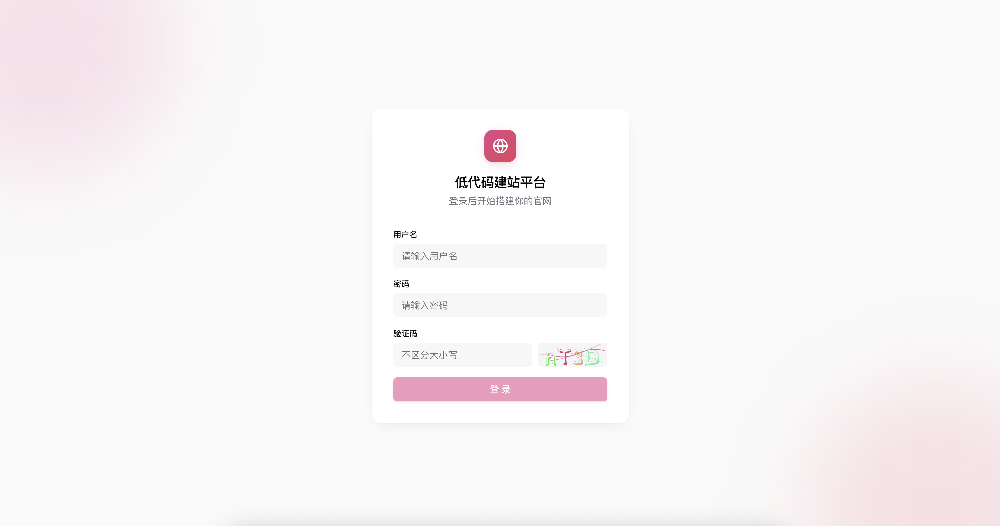
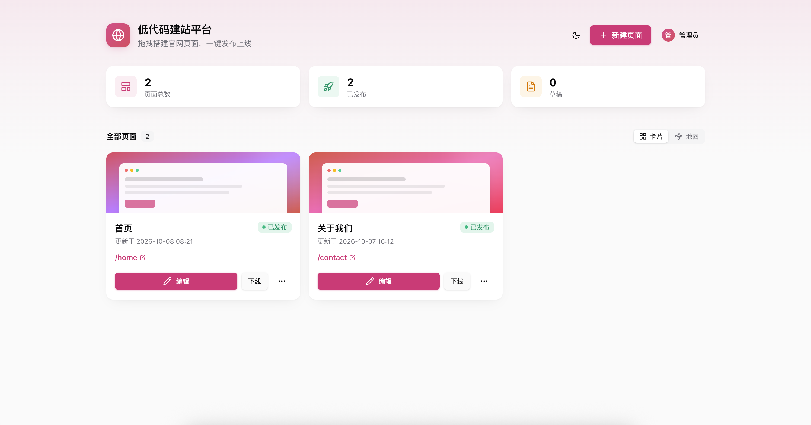
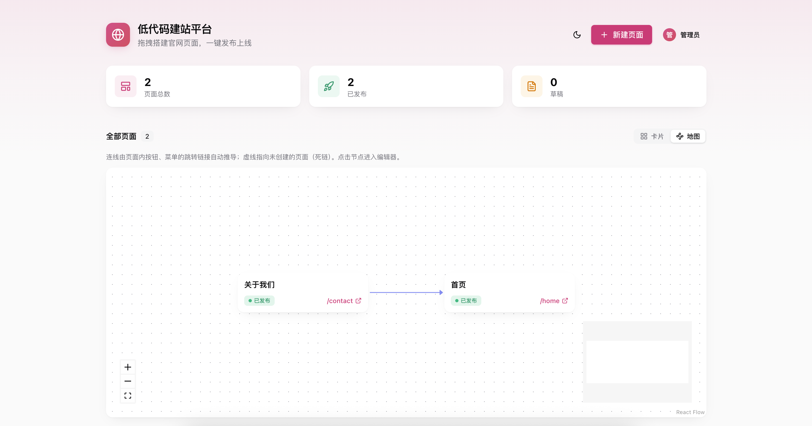
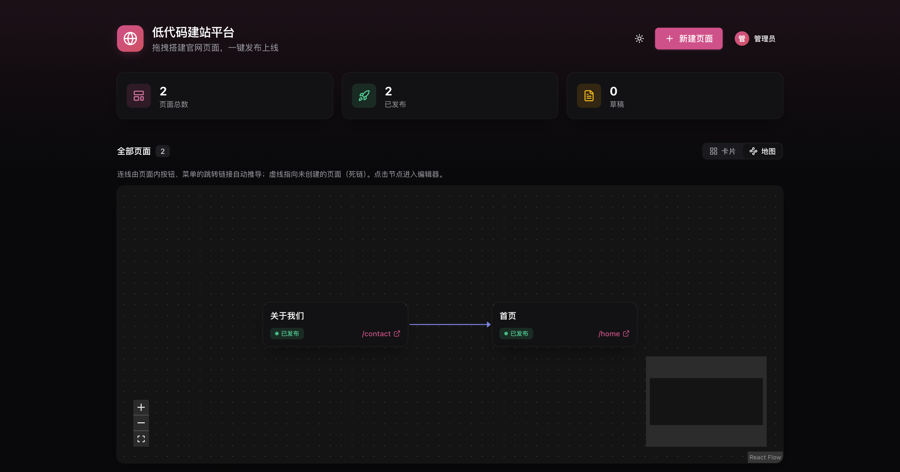
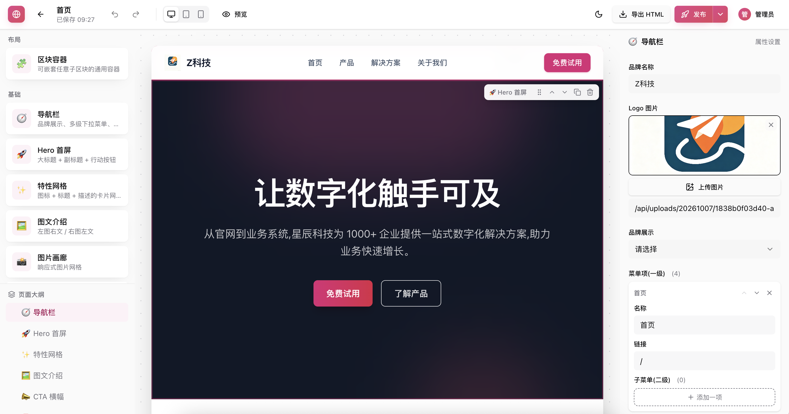
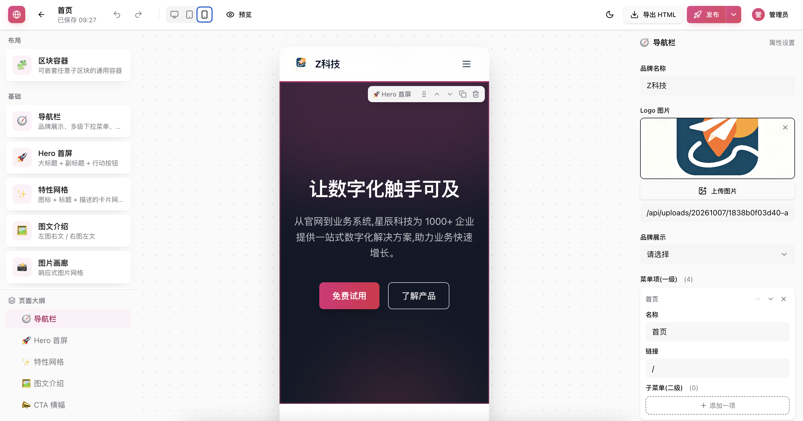
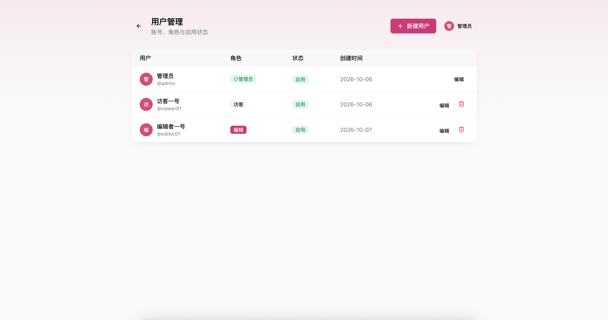
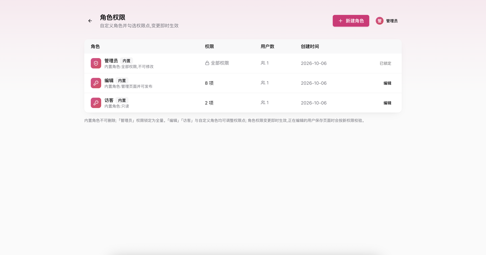

# 低代码可视化建站平台

拖拽生成、一键发布官网页面的低代码平台。三栏可视化编辑器（物料库 / 画布 / 属性面板），页面以 JSON Schema 持久化，支持平台托管发布（`/dashboard` 后台 + `/{slug}` 直接访问）与静态 HTML 导出（任意部署），内置联系表单线索收集。

## 功能

- **登录鉴权 + 动态 RBAC**：JWT 双 token，角色存于数据库可自定义（内置 `admin / editor / viewer`），权限点校验 + 前端按钮显隐与路由守卫
- **页面级协作权限**：页面可设「限制访问」并把任意用户加为该页编辑者/查看者，不受其全局角色限制
- **可视化编辑器**：物料拖入画布、画布内拖拽排序、点击选中、属性面板按物料定义自动生成、区块样式（背景/内边距）覆盖
- **容器嵌套**：「区块容器」物料可嵌套任意子区块，支持跨容器拖拽移动、大纲树展示层级结构；渲染器递归渲染子节点，发布/导出同样生效
- **所见即所得**：编辑画布、发布页、静态导出共用同一 React 渲染器；物料基于容器查询，设备模拟（桌面/平板/手机）与真实响应一致
- **编辑体验**：撤销/重做（Ctrl+Z / Ctrl+Shift+Z）、防抖自动保存、页面大纲树
- **图片上传**：物料图片属性支持平台内直接上传，存储可选本地磁盘（默认）或 S3 兼容对象存储（阿里云 OSS / 腾讯云 COS / MinIO / AWS S3）；无上传权限时仍可粘贴外部 URL
- **主题色全局配置**：站点设置配置品牌主色，自动推导完整深浅色阶；编辑器画布、发布页、静态导出 HTML 整体换肤
- **自定义域名绑定**：页面可绑定自定义域名，域名解析到平台后访问即出该页发布内容，平台自身路径不受影响
- **发布**：发布快照 + 可自定义 slug，`/{slug}` 挂根路径 SSR 直出（SEO title），Redis 缓存加速；slug 为 `home` 的页面作为站点首页；支持下线与重新发布
- **表单收集**：联系表单提交入库（带 IP 限流），后台查看提交数据
- **静态导出**：自包含单文件 HTML（内联 CSS + 表单提交脚本），可部署到任意静态服务器
- **多页面管理**：新建（空白/官网落地页模板）、复制、删除、下线

## 快速开始

要求：Node 20+，pnpm 10+，Docker（提供数据库）。

```bash
# 1. 启动数据库
docker compose up -d postgres redis

# 2. 安装依赖 + 建表
pnpm install
pnpm db:migrate
pnpm --filter server seed   # 可选：创建管理员 admin / admin123 + 演示页面「官网首页」

# 3. 启动前后端（并行）
pnpm dev   # web http://localhost:3000  server http://localhost:3001
```

打开 http://localhost:3000 会重定向到后台 `/dashboard`（未登录先跳登录页），默认账号 `admin / admin123`（请在「用户管理」中尽快修改密码）。

Docker 一键部署：

```bash
docker compose up -d --build
```

## 效果展示

### 登录


### 后台与页面管理

**页面管理（卡片视图）**


**页面关系地图**
连线由页面内按钮、菜单的跳转链接自动推导；虚线指向未创建的页面（死链），点击节点进入编辑器。支持浅色 / 深色主题。




### 可视化编辑器

三栏布局（物料库 / 画布 / 属性面板），所见即所得，支持桌面 / 平板 / 手机设备模拟。

**桌面预览**


**移动端预览**


### 用户与权限

内置 `admin / editor / viewer` 三角色，支持自定义角色与权限点勾选，变更即时生效。




### 全局主题色

后台界面、编辑预览、发布页与静态导出统一换肤。


